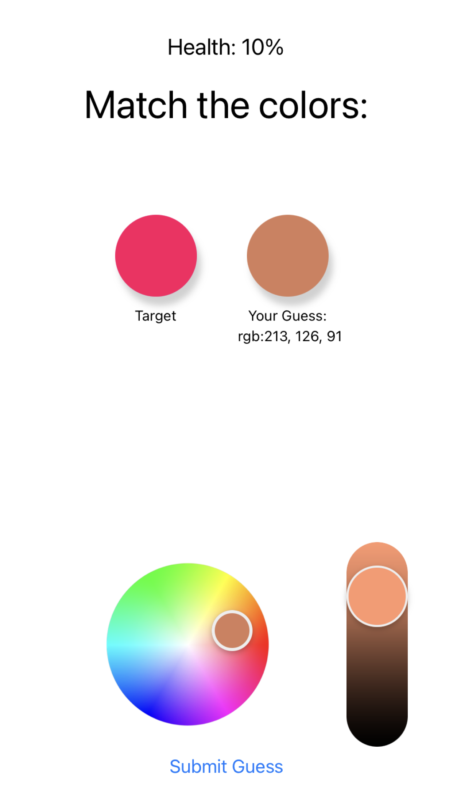
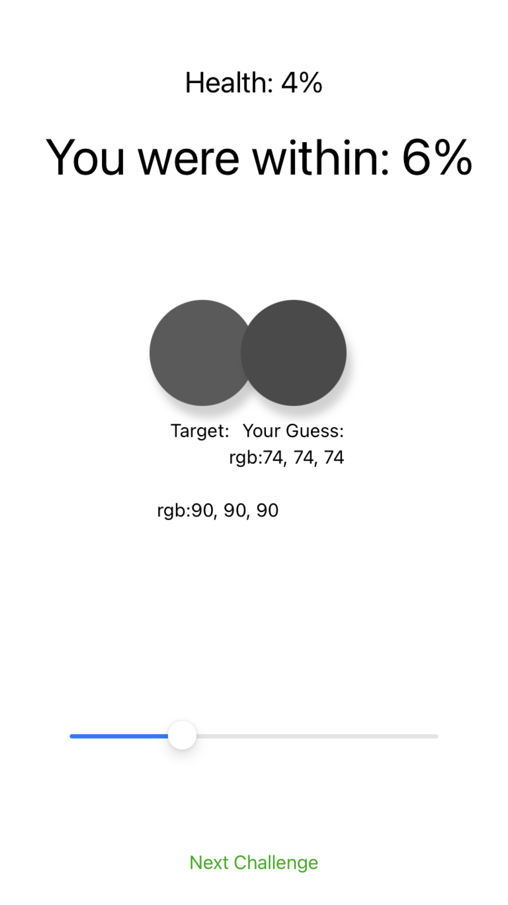

# Introduction

A simple mobile application that challenges users to test their accuracy in matching colors. It features both color and greyscale modes.
It incorporates very basic gamification to make it a bit more fun.

The app is compatible with Android, iOS, and web .

## Availability

- **iOS**: [Guess That Color on the App Store](https://apps.apple.com/us/app/guess-that-color/id6479181014)
- **Android**: [Guess That Color on Google Play](https://play.google.com/store/apps/details?id=com.jasonify.valuegame&hl=es_MX&gl=US)


## Screenshots

- **Full Color Mode Example**


- **Greyscale Mode Example**



# Setup
```
npm install

npm  start
```

# Tasks:
    [ ] hard mode with background contrasting
    [ ] shadow bug on android/native
    [ ] Clean up UI
        - investigate typography
        - investigate custom slider


## Handling Apple Errors

If authentication with the Apple Developer Portal fails, citing a maintenance activity error, try the following solutions:

1. Check the [Apple System Status](https://developer.apple.com/system-status/) for any ongoing maintenance activities.
2. If the issue persists, forcefully reinstall the `eas-cli`:
3. If it keeps occuring, use:
`npm install -g eas-cli --force`

